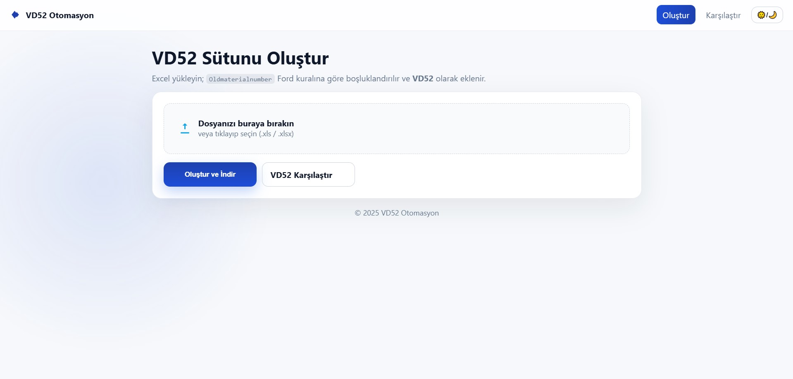
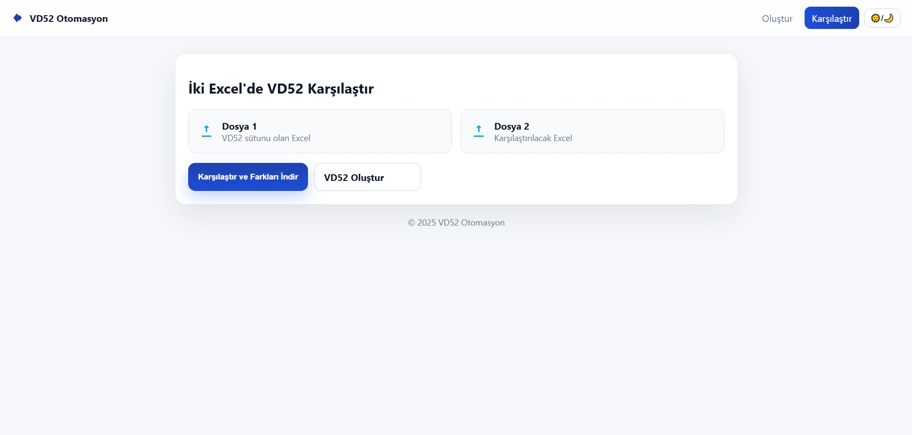

# 🚗 VD52 Otomasyon

Ford parça kodlarınınkuralına uygun otomatik boşluklandırılması ve karşılaştırılması için geliştirilmiş bir **Flask tabanlı web uygulaması**.  
Uygulama Excel dosyalarını işler, `Oldmaterialnumber` sütununu Ford kuralına göre ayrıştırır ve `VD52` sütunu olarak ekler. Ayrıca iki Excel dosyasındaki `VD52` sütunlarını satır satır karşılaştırabilir.

## ✨ Özellikler
- 📂 Excel dosyası yükle (.xls / .xlsx)
- 🔄 `Oldmaterialnumber` → `VD52` otomatik formatlama  
  - Ön kod: 4 veya 5 karakter (algoritma en uygununu seçer)  
  - Orta kod: `14F680, 10C714, 8C436, A405A02, R17757, 17757, 405C54...`  
  - Son kod: **asla kesilmez**, olduğu gibi yazılır
- ⚖️ İki Excel’de `VD52` sütunlarını karşılaştır ve farklı satırları indir
- 🌗 Açık / Koyu tema desteği
- 🎨 Modern, kurumsal arayüz (HTML + CSS)

## 🚀 Kurulum

```bash
# 1. Projeyi klonla
git clone https://github.com/kullaniciadi/vd52-otomasyon.git
cd vd52-otomasyon

# 2. Sanal ortam oluştur
python -m venv venv
# Windows
venv\Scripts\activate
# Linux / macOS
source venv/bin/activate

# 3. Bağımlılıkları yükle
pip install -r requirements.txt

# 4. Uygulamayı başlat
python app.py
```
👉 Tarayıcıda aç: **http://127.0.0.1:5000**

## 📂 Proje Yapısı
```
kod-otomasyonu/
├── screenshots/
│   ├── index.jpg
│   ├── compare.jpg
├── static/
│   └── style.css
├── templates/
│   ├── index.html
│   ├── compare.html
├── app.py
├── requirements.txt
└── venv/
```

## 📊 Kullanım

### VD52 Oluştur
1. Excel dosyası yükle (`Oldmaterialnumber` sütunu olmalı).  
2. “Oluştur ve İndir” butonuna tıkla.  
3. Yeni Excel’de `VD52` sütunu eklenmiş şekilde gelir.  

### VD52 Karşılaştır
1. İki farklı Excel dosyası yükle.  
2. “Karşılaştır ve Farkları İndir” butonuna tıkla.  
3. Farklı satırlar yeni Excel’de listelenir.  

## ⚙️ Teknolojiler
- Python 3  
- Flask  
- Pandas  
- XlsxWriter  
- HTML + CSS (kurumsal tema)

## 🖼️ Ekran Görüntüsü



## 📌 Notlar
- `Oldmaterialnumber` sütununun başında **M** varsa, algoritma otomatik olarak siler.  
- Algoritma öncelikle 4 ve 5 karakterlik ön kod denemesi yapar, en iyi eşleşmeyi seçer.  
- Hatalı veya sıra dışı kodlar için fallback mekanizması bulunur.

## 👨‍💻 Geliştiren
**Mehmet TAT**  
- [GitHub](https://github.com/mexmettat)  
- [LinkedIn](https://www.linkedin.com/in/mehmettat/)
